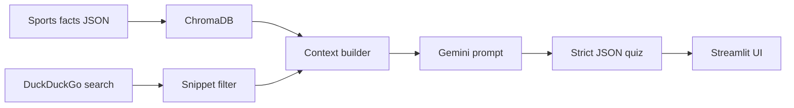
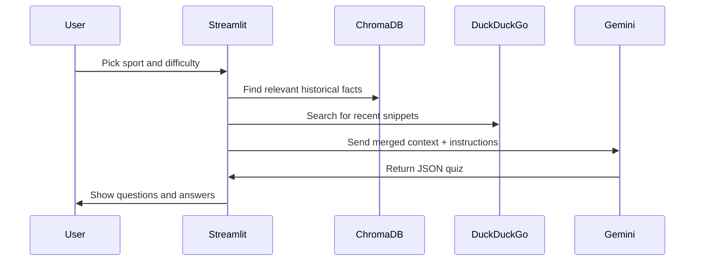
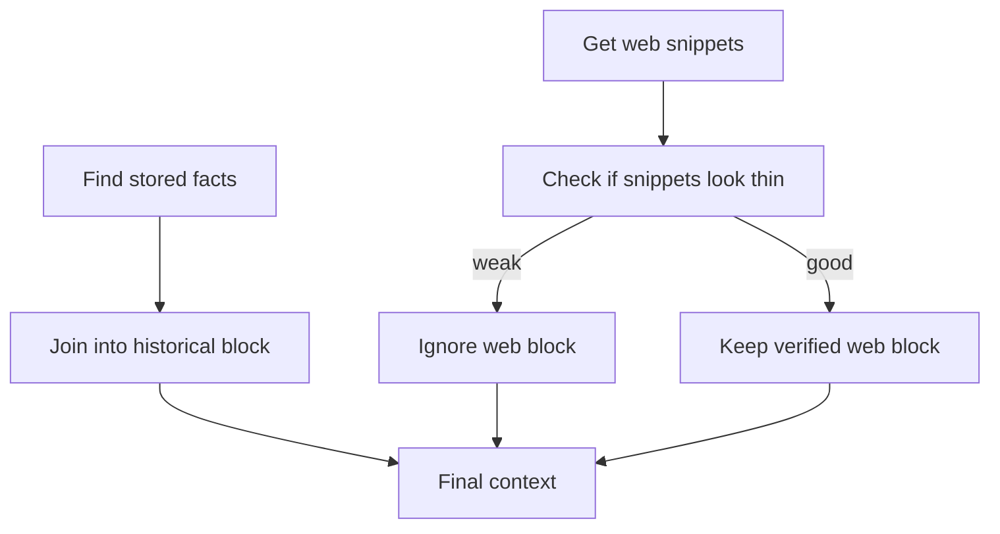

# How this project works

This file explains the core ideas behind the app. For setup and run
instructions, see [README.md](README.md).

## Big Picture



<details>
<summary>What each block means</summary>

| Block | Role | Why it matters |
|---|---|---|
| Sports facts JSON | offline source of truth | stable historical context |
| ChromaDB | semantic retrieval | finds related facts by meaning |
| DuckDuckGo search | live freshness layer | adds recent sports news |
| Snippet filter | quality control | drops noisy score-table style results |
| Context builder | source merger | keeps facts and web results clearly separated |
| Gemini prompt | generation step | forces the model to stay grounded |
| Strict JSON quiz | output format | easy to parse in the app |
| Streamlit UI | presentation layer | renders the quiz and feedback |

</details>

## Retrieval vs Generation



<details>
<summary>Why this is RAG</summary>

The model does not answer from memory alone. It gets facts first, then
turns those facts into questions. That is the retrieval-augmented part.

</details>

## Where the data comes from

| Source | Code path | Strength | Weak spot |
|---|---|---|---|
| ChromaDB | `src/database.py` | reliable sports history | not fresh |
| DuckDuckGo | `src/search.py` | current news and events | noisy snippets |

<details>
<summary>Why two sources are used</summary>

ChromaDB gives stable facts. DuckDuckGo adds recency. The app combines
both so quizzes stay grounded without becoming stale.

</details>

## How the context is built



<details>
<summary>What “thin” means</summary>

`looks_thin()` inspects the whole web block. If too many lines still look
like scoreboard or odds content, the app drops the entire web section
instead of feeding partial junk to Gemini.

</details>

## Why the prompt is structured

| Prompt part | Purpose |
|---|---|
| System message | sets the rules and guardrails |
| User message | gives the actual quiz task |
| JSON schema | makes the answer easy to parse |

<details>
<summary>Simple interview version</summary>

"The system prompt tells Gemini not to invent facts, and the user prompt
forces a strict JSON quiz format."

</details>

## Cleanup after generation

```mermaid
flowchart LR
    A[Gemini JSON] --> B[json.loads()]
    B --> C[Normalize fields]
    C --> D[Remove near-duplicate explanations]
    D --> E[Ready for the UI]
```

<details>
<summary>Deduping logic</summary>

The duplicate check is intentionally simple. It compares word overlap in
explanations, not vector embeddings, because this is a lightweight
post-processing step.

</details>

## Known limitation

If Gemini returns malformed JSON, `parse_reply()` will still raise a
`json.JSONDecodeError`. That is a real limitation, and it is better to
mention it directly than pretend the parser is bulletproof.
